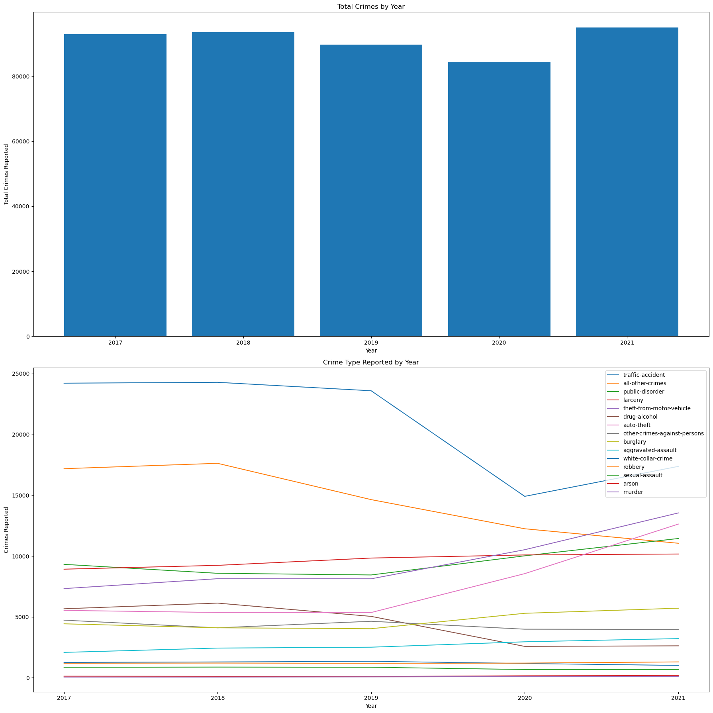
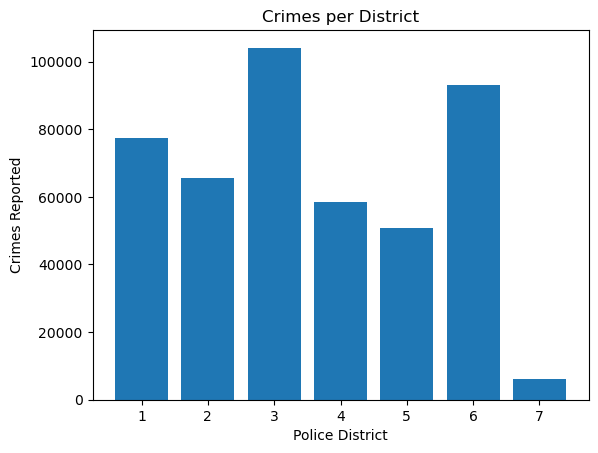

# EDA of Denver Public Crime Data (2017-2021)

***
 

## Table of Contents
***

 

## **Introduction**
***
* This dataset, which can be found [here] (https://www.kaggle.com/datasets/paultimothymooney/denver-crime-data), includes public data on the type of crimes reported in Denver, Colorado from the time period 2017-2021. It is important to note that this dataset only includes data from crimes that have been reported, as it is difficult to collect accurate data on crimes that are not reported and investigated. Data from the first 2 months of 2022 were included in the raw data, but have been excluded from this exploratory data analysis due to the small sample size compared to the other years.
 
 

## **Data Overview**
***

* The first approach to get a general picture of how the dataset is distributed was to look at the total number and type of crimes reported every year. THis allows for a general overview of any trends in the time series data for the crime rate.
 

* The first bar chart shows very little change in the trend of overall crime in Denver over the time period. Each year has a fairly consistent number.

* The second line plot shows the changes over the time period in the amount of each crime category reported. This chart reveals that the same crime categories are prevalent in each year in the dataset even if the total number varies. Crime categories such as arson have seen very low numbers every year.
 
 

## **Crime Distribution by Location**
***

* The first location analysis was done by counting the total number of crimes in each of the 7 police districts over the whole time period.
 

 

* It is apparent that district 7 has a significantly lower crime rate than the other 6 districts over the given time period. However, this chart gives no information as to the location of each district within the city.
 
 

 

* This heatmap does a better job helping visualize the distribution of crime throughout the city. It shows that the total amount of crime is pretty equally distributed throughout the whole area. 

Dataset only contains values from the time period January 2017 through February 2022.