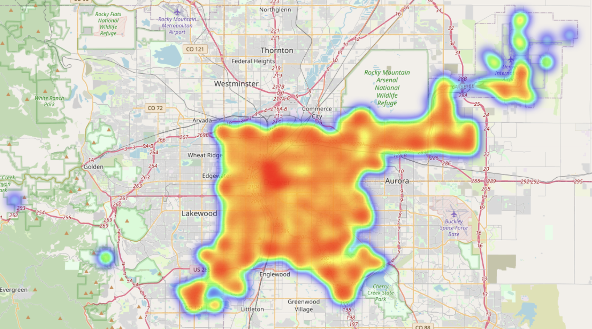
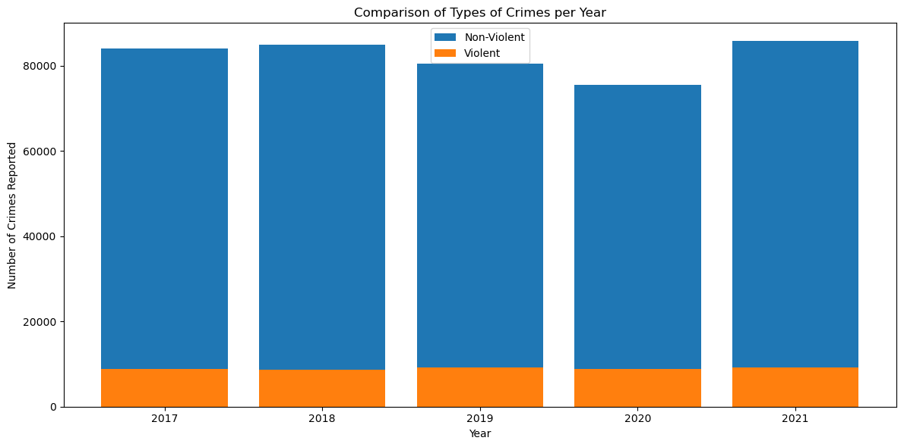

# EDA of Denver Public Crime Data (2017-2021)

***
 
 

## Table of Contents
***
- [Introduction](#introduction)
- [Data Overview](#data-overview)
    - [Overall Crime Per Year](#overall-crime-per-year)
    - [Total Crime By Category](#total-crime-by-category)
    - [Average Increase in Crime Category](#average-increase-in-crime-category)
- [Crime Distrbution By Location](#crime-distribution-by-location)
    - [Crimes per District](#crimes-per-district)
    - [Total Crime Heatmap](#total-crime-heatmap)
- [Violent Crime Analysis](#violent-crime-analysis)
    - [Violent/Non-Violent Crimes per Year](#violentnon-violent-crimes-per-year)
    - [Violent Crime Heatmap](#violent-crime-heatmap)

 
 

## **Introduction**
***
* This dataset, which can be found [here] (https://www.kaggle.com/datasets/paultimothymooney/denver-crime-data), includes public data on the type of crimes reported in Denver, Colorado from the time period 2017-2021. It is important to note that this dataset only includes data from crimes that have been reported, as it is difficult to collect accurate data on crimes that are not reported and investigated. Data from the first 2 months of 2022 were included in the raw data, but have been excluded from this exploratory data analysis due to the small sample size compared to the other years.
 
 
 

## **Data Overview**
***

* The first approach to get a general picture of how the dataset is distributed was to look at the total number and type of crimes reported every year. THis allows for a general overview of any trends in the time series data for the crime rate.
 
 

## **Overall Crime Per Year**
***

* The first bar chart shows very little change in the trend of overall crime in Denver over the time period. Each year has a fairly consistent number.

* The second line plot shows the changes over the time period in the amount of each crime category reported. This chart reveals that the same crime categories are prevalent in each year in the dataset even if the total number varies. Crime categories such as arson have seen very low numbers every year. That is the area of analysis that will be further explored.
 
 

## **Total Crime By Category**
***

* This horizontal bar chart shows the cumulative count of each category of crime over the time period. Through this visualization, it becomes apparent that traffic accidents and other non-violent crimes account for most of the data. Since violent crime is usually of a larger concern for individual safety, that is the area of analysis that will be further explored.
 
 

## **Average Increase in Crime Category**
***

 

* The horizontal bar chart shows the average numerical increase in each type of crime from 2017-2021. There are both benefits and drawbacks to using the numerical values instead of a percentage. This chart displays the change in real numerical values, so it can be hard to identify in crime categories that have a small overall number. Given more time for further analysis, this chart would be supplemented with another chart to show the percentage change as well.
 
 
 

## **Crime Distribution by Location**
***

* The first location analysis was done by counting the total number of crimes in each of the 7 police districts over the whole time period.
 

## **Crimes per District**
***

 

* It is apparent that district 7 has a significantly lower crime rate than the other 6 districts over the given time period. However, this chart gives no information as to the location of each district within the city.
 
 

## **Total Crime Heatmap**
***

 

* This heatmap does a better job helping visualize the distribution of crime throughout the city. It shows that the total amount of crime is pretty equally distributed throughout the whole area with only a slight concentration in the downtown area.
 
 
 

## **Violent Crime Analysis**
***
 

## **Violent/Non-Violent Crimes per Year**
***

 

* TViolent crimes were chosen to be sexual assault, murder, robbery, aggravated assault, and other crimes against persons. This stacked bar chart shows a direct comparison between the amount of crimes committed each year classified as either violent or non-violent. Non-violent crimes happen in significantly larger numbers and the ratio appears to stay fairly consistent across all 5 years in the dataset.

 
 

## **Violent Crime Heatmap**
***

 

* Violent crimes were chosen to be sexual assault, murder, robbery, aggravated assault, and other crimes against persons. The violent crimes heatmap shows a very similar pattern to the overall crime heatmap. There is a slight bigger concentration in the central downtown area, but still distribution throughout the whole city limits.

 
 